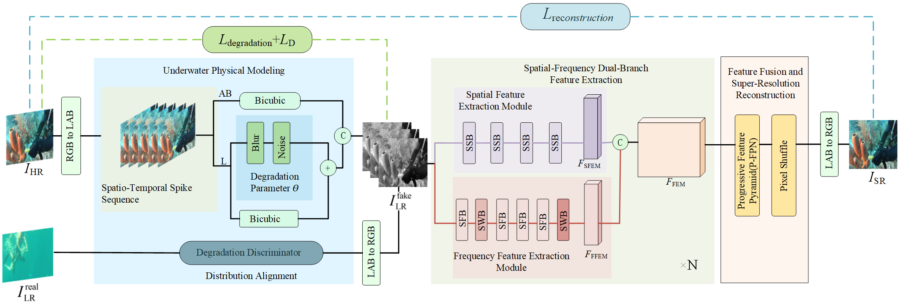

# PDD-SNN

[English README](./README.md)

## 项目概述
PDD-SNN 是一个基于脉冲神经网络（SNN）的水下图像恢复研究代码仓库。当前版本已经将原先按数据集分散复制的多套脚本收敛为一套主代码，并通过不同实验配置切换训练流程。

## 总体框架图
PDD-SNN 的整体框架如下图所示。



PDD-SNN 主要由三个协同模块组成：
- `UPM`（Underwater Physical Modeling）：基于水下物理先验构建退化感知训练样本。
- `SFDF`（Spatial-Frequency Dual-Branch Feature Extraction）：联合提取空间细节与频域表征。
- `FFSR`（Feature Fusion and Super-Resolution Reconstruction）：融合多尺度脉冲特征并重建最终高分辨率输出。

## 主要特性
- 统一的训练入口，同时支持联合退化+重建训练和纯监督重建训练
- 统一的推理与评估脚本
- 结构化的 Python 实验配置，集中放在 `configs/experiments/`
- 原始历史代码归档到 `legacy/`

## 仓库结构
```text
.
├── assets/                     # 静态资源，如 NIQE 先验文件
├── configs/
│   ├── experiments/           # 实验配置模板
│   └── paths/                 # 本地路径配置示例
├── legacy/                    # 整理前的原始代码快照
├── scripts/                   # 统一 CLI 入口
├── underwater_snn/            # 主工程代码
├── README.md
├── README.zh-CN.md
└── requirements.txt
```

## 环境准备
建议使用 Python 3.10 及以上版本，并在独立虚拟环境中安装依赖。

## 安装 PyTorch
请根据本机 CUDA 版本，从 PyTorch 官方渠道安装 `torch`、`torchvision`，如有需要也可安装 `torchaudio`。

## 安装其余依赖
```bash
pip install -r requirements.txt
```
当前 `requirements.txt` 固定了 `numpy<2`，用于规避现有 SciPy 指标链路的二进制兼容问题。

## 数据集说明
本仓库不直接分发训练集或测试集，请从原始公开来源下载数据，并按本地环境整理到 `data/` 目录下。

本项目实验使用了多个公开水下数据集，不同数据集承担的角色不同：

### Train-1360
- 名称：`UIESR_dataset_Train-1360`
- 来源：[Underwater-Lab-SHU/UIESR_dataset_Train-1360](https://github.com/Underwater-Lab-SHU/UIESR_dataset_Train-1360)
- 用途：作为核心真实水下训练数据源，用于学习水下退化分布先验
- 说明：按照本文实验设计，该数据集并不是简单作为标准配对 benchmark 使用，而是用于退化感知训练

### Test-206
- 名称：`UIESR_dataset_Test-206`
- 来源：[Underwater-Lab-SHU/UIESR_dataset_Test-206](https://github.com/Underwater-Lab-SHU/UIESR_dataset_Test-206)
- 用途：作为与 Train-1360 同源分布的内部评估与消融测试子集

### UFO-120
- 用途：作为与已有水下超分方法进行定量对比的主 benchmark 数据集
- 说明：仓库当前提供了一个重建任务示例配置 `configs/experiments/ufo_recon_x2.py`

### UIEB
- 用途：用于真实水下场景下的零样本跨域泛化测试
- 说明：仓库当前提供了一个联合训练示例模板 `configs/experiments/uieb_joint_x2.py`

### 当前提供的配置模板
- `configs/experiments/train1360_joint_x2.py`：对应论文中 Train-1360 训练、Test-206 同源验证/消融的联合训练模板
- `configs/experiments/ufo_recon_x2.py`：对应 UFO-120 配对重建 benchmark 的示例模板
- `configs/experiments/uieb_joint_x2.py`：对应 UIEB 跨域泛化流程的示例模板

请根据所选实验配置，将不同数据集映射到本地目录。配对 benchmark、真实训练数据和内部消融子集的目录组织方式可以不同，不必强行使用统一的 train/test 目录模板。

## 配置数据路径
修改 `configs/experiments/` 下的实验配置文件，或者复制 `configs/paths/example_paths.py` 后按本地环境创建自己的配置版本。请将其中的 `data/...` 占位路径替换成你真实的数据集、输出目录和检查点目录。

## 训练
联合训练：
```bash
python scripts/train.py --config configs/experiments/joint_scale2.py
```

Baseline 训练：
```bash
python scripts/train.py --config configs/experiments/baseline_scale4.py
```

UFO 纯重建训练：
```bash
python scripts/train.py --config configs/experiments/ufo_recon_x2.py
```

仅做配置与模型结构检查：
```bash
python scripts/train.py --config configs/experiments/joint_scale2.py --dry-run
```

## 推理
```bash
python scripts/infer.py \
  --config configs/experiments/ufo_recon_x2.py \
  --checkpoint outputs/ufo_recon_x2/best_reconstruction_net.pth \
  --input-dir data/UFO120/test/lr_x2 \
  --output-dir outputs/ufo_recon_x2/inference \
  --gt-dir data/UFO120/test/hr
```

## 评估
```bash
python scripts/evaluate.py \
  --config configs/experiments/ufo_recon_x2.py \
  --pred-dir outputs/ufo_recon_x2/inference \
  --gt-dir data/UFO120/test/hr
```

## 已知限制
- 仓库本身不包含数据集和训练权重。
- 一部分历史研究脚本已归档到 `legacy/`，不再属于主流程。
- 当前训练和推理流程仍依赖 `spikingjelly`、`lpips` 等第三方库；正式运行前建议先执行 `--dry-run` 检查结构和依赖。
